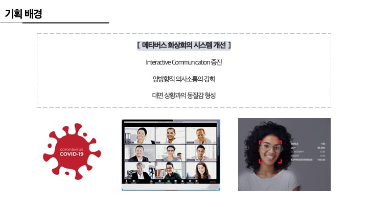
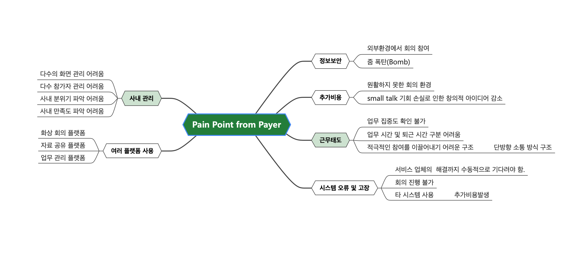
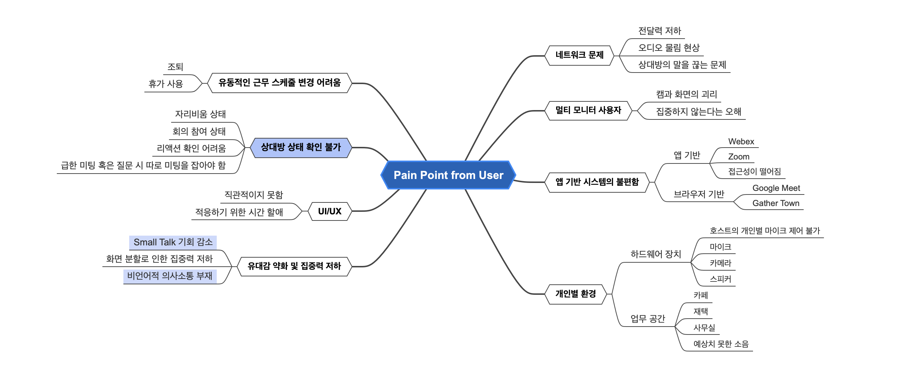
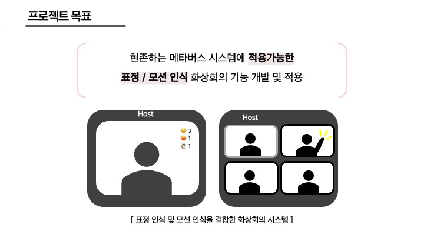
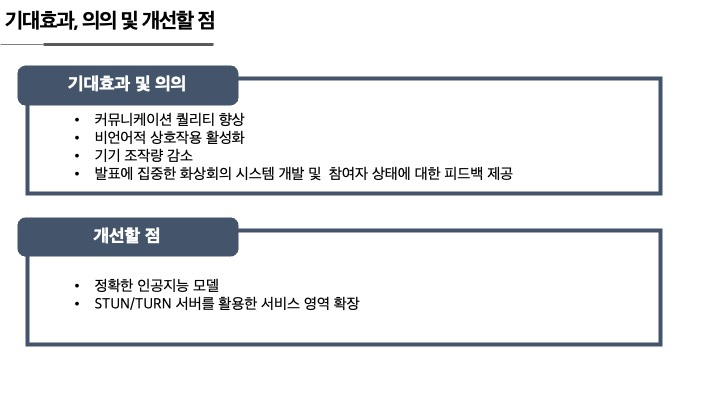

# 인공지능을 활용해 개선된 메타버스 화상회의 시스템
2021-2 융합캡스톤디자인_팀 보석귤

### 프로젝트 진행 배경

### 프로젝트 목표

### 기대효과

## 개발환경  
- Python 3.8.5  
- Django 3.2.6   
- Django Channels 3.0.4

## 개발자
- [김연진](https://github.com/ygk313)
- [엄순호](https://github.com/shum0415)
- [최성연](https://github.com/seongyeonee)
